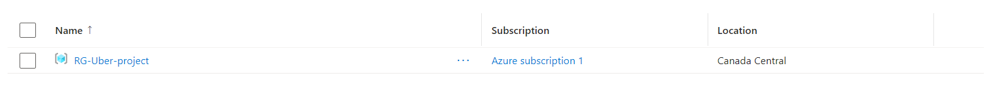
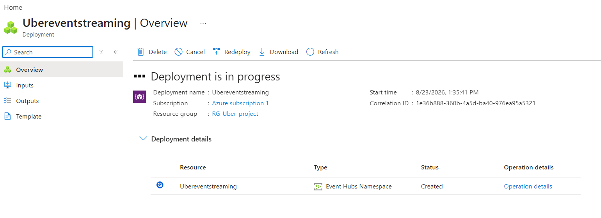
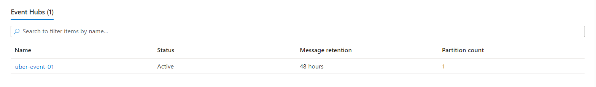
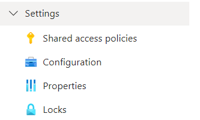

# Phase 01 — Event Hub Configuration

## Step 1 — Create an Azure Account

To use Azure services, first create an Azure account.

You can also use an **Azure for Students** account if you have a valid student email.

Open the Azure Portal:

`https://portal.azure.com`

> **Note:** Never include personal email addresses, payment details, passwords, API keys, or connection strings in project documentation.

---

## Step 2 — Create a Resource Group

A **Resource Group** is a logical container where the Azure resources used by a project are organized.

For example:

```text
Resource Group
│
├── Event Hub Namespace
├── Event Hub
├── Data Factory
└── Data Lake
```

Create a Resource Group from the Azure Portal.



---

## Step 3 — Create an Event Hub Namespace

An **Event Hub Namespace** is a container that can hold multiple Event Hubs.

While creating the namespace, configure:

1. Resource Group
2. Namespace name
3. Region
4. Pricing tier

For this project, the **Standard** tier is used because it provides the required capabilities, including the Kafka-compatible interface.



---

## Event Hub vs Event Hub Namespace

The difference is simple:

> **Event Hub Namespace** → Container that holds Event Hubs.  
> **Event Hub** → The actual place where events are sent and stored.

One namespace can contain multiple Event Hubs.

```text
Event Hub Namespace
│
├── Orders Event Hub
├── Payments Event Hub
└── Users Event Hub
```

### Key Points

- Event Hub is a managed streaming service, so we do not have to manage the underlying infrastructure.
- Azure Event Hubs also provides a **Kafka-compatible interface**.

---

## Step 4 — Create an Event Hub

After creating the namespace, create the actual Event Hub inside it.

Example:

```text
Event Hub Namespace
        │
        ▼
   uber-event-01
```

Configure the required settings, including the **partition count**.



Example Event Hub name:

`uber-event-01`

### Partitions

Partitions divide an Event Hub into smaller sections so that event data can be handled efficiently.

```text
uber-event-01
│
├── Partition 0
├── Partition 1
└── Partition 2
```

---

## Step 5 — Create an Access Policy

An **Access Policy** controls who is authorized to interact with the Event Hub.

Without the required authorization, an application cannot send or consume events.

Go to:

```text
Event Hub
    ↓
Settings
    ↓
Shared access policies
```



### Send Permission

A producer needs **Send** permission to send events to the Event Hub.

```text
Web Application
       │
       │ Send
       ▼
   Event Hub
```

For our project:

```text
Web App → Send Policy → Event Hub
```

### Listen Permission

A consumer needs **Listen** permission to read events from the Event Hub.

```text
Event Hub
    │
    │ Listen
    ▼
Databricks
```

For our project:

```text
Event Hub → Listen Policy → Databricks
```

---

## Important

Access policies can be created at the **Namespace level** or the **Event Hub level**.

A namespace-level policy can provide access across the Event Hubs within that namespace.

For this project, we create the policy at the **Event Hub level** so that the producer only gets access to the specific Event Hub it needs.

```text
Event Hub Namespace
│
├── Event Hub 01
│      └── Send Policy
│
├── Event Hub 02
│
└── Event Hub 03
```

---

## Complete Event Hub Workflow

```text
Web Application
       │
       │ Ride Events
       ▼
  Send Policy
       │
       ▼
   Event Hub
       │
       │ Streaming Events
       ▼
 Listen Policy
       │
       ▼
   Databricks
       │
       ▼
     Bronze
```

---

## Phase 01 Result

At the end of this phase, the Event Hub infrastructure is ready for the real-time pipeline.

```text
Resource Group
      │
      ▼
Event Hub Namespace
      │
      ▼
Event Hub
   ┌──┴──┐
   │     │
 Send   Listen
   │     │
   ▼     ▼
Web App  Databricks
```