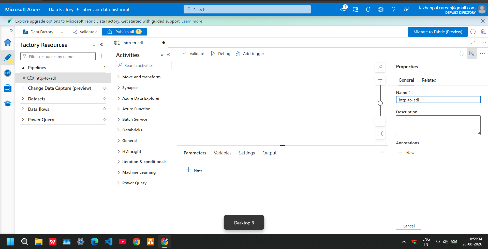
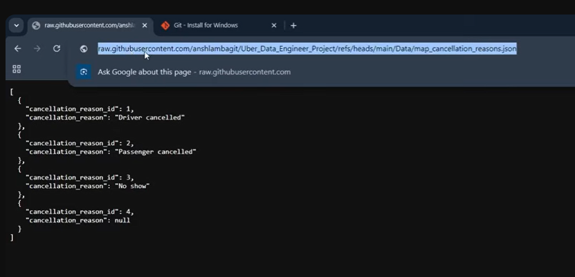
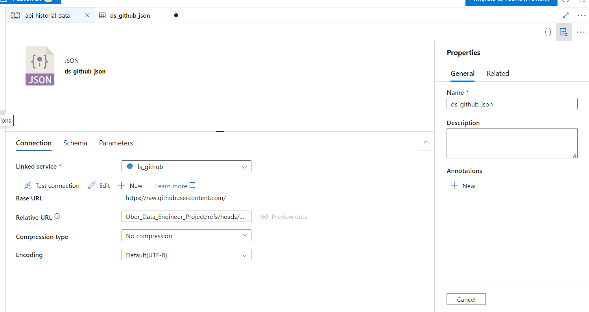
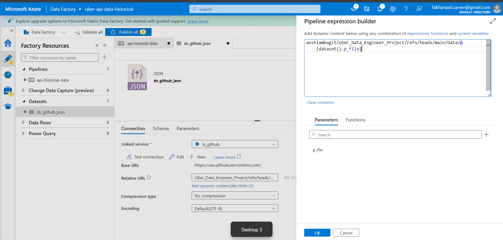

# Phase 03 — Historical Data Ingestion with Azure Data Factory

## Phase Objective

The objective of this phase is to build the **historical/batch data ingestion pipeline** that moves data from GitHub into an Azure Data Lake using Azure Data Factory (ADF).

In this project, GitHub acts as a **simulated source system**.

The overall flow is:

```text
GitHub
   │
   ▼
Azure Data Factory
   │
   ▼
Azure Data Lake
```

In a real company, the architecture would look more like:

```text
Internal Operational / Source Systems
             │
             ▼
        Data Pipeline
             │
             ▼
          Data Lake
             │
             ▼
       Analytics / ML / BI
```

---

# 1. Understanding Operational Systems and Data Lake

A company like Uber can have operational/internal systems that retain both current and historical operational data.

The important distinction is the **purpose** of the systems.

## Operational System

An operational system primarily stores data so that the company's applications can run the business.

For example:

- Rides
- Drivers
- Customers
- Payments
- Ride status

Operational systems may also retain historical records for operational, compliance, or other purposes.

## Data Lake

A Data Lake is part of the company's broader data and analytics platform.

It can store large amounts of historical data so that:

- Data Engineers
- Data Analysts
- BI systems
- ML systems

can use the data later.

### Important Concept

A common misunderstanding is:

> "When Uber needs historical data, they load it into the Data Lake."

Instead, companies generally build **ongoing pipelines** that continuously or periodically move data from operational/source systems into the data platform.

For example:

```text
Monday's Rides
      │
      ▼
   Pipeline
      │
      ▼
  Data Lake

Tuesday's Rides
      │
      ▼
   Pipeline
      │
      ▼
  Data Lake

Wednesday's Rides
      │
      ▼
   Pipeline
      │
      ▼
  Data Lake
```

After several years:

```text
Data Lake
│
├── 2023
├── 2024
├── 2025
└── 2026
```

---

# 2. Real Company vs Tutorial

## Real Company

```text
Internal Operational / Source System
             │
             ▼
        Data Pipeline
             │
             ▼
          Data Lake
```

## Tutorial

```text
GitHub
(simulated source system)
             │
             ▼
        ADF Pipeline
             │
             ▼
          Data Lake
```

GitHub is therefore pretending to be the **upstream source system**, while the Data Lake is the destination/data platform.

---

# 3. Create Azure Data Factory

Go to the Azure Resource Manager / Azure Portal.

Search for:

```text
Azure Data Factory
```

Select Azure Data Factory and create the required resource.

Configure the required:

- Resource Group
- Region
- Data Factory name

The Data Factory will be responsible for orchestrating the data movement.

---

# 4. Create the Data Lake

The project needs a Data Lake to store the data.

Search for:

```text
Storage Account
```

Select a Storage Account with **Data Lake Storage Gen2** capabilities.

There are several configuration options, including:

- Performance
- Redundancy
- Primary workload
- Advanced options

For this project:

```text
Redundancy:
Locally Redundant Storage (LRS)
```

Under advanced options:

```text
Hierarchical Namespace:
Enabled
```

The hierarchical namespace is important for Data Lake Storage Gen2 and large analytics workloads.

---

# 5. GitHub Data

The GitHub repository contains the data that will be ingested into the Data Lake.

There are two main types of files.

## 5.1 Initial Historical Data

The main historical data file is:

```text
bulk_rides.json
```

This represents the initial load of historical ride data.

The approach is similar to a **lift-and-shift historical data load**.

When a company builds a data engineering solution for the first time, it may perform an initial historical data load.

```text
Existing Historical Data
          │
          ▼
   Initial Data Load
          │
          ▼
      Data Lake
```

After the initial load, ongoing pipelines can bring new data into the data platform.

---

# 6. Mapping Files

The remaining files are **mapping/reference files**.

They are used to translate a code or ID in the main ride data into a meaningful value.

For example:

```json
{
  "city_id": 3,
  "payment_method_id": 2,
  "ride_status_id": 1
}
```

Those numbers are not very useful by themselves.

A mapping file might contain:

```json
{
  "1": "New York",
  "2": "Chicago",
  "3": "Delhi"
}
```

Now the pipeline can translate:

```text
city_id = 3
      │
      ▼
map_cities.json
      │
      ▼
    Delhi
```

The pipeline uses the mapping data to decode and enrich the main ride data.

---

# 7. Why Use Mapping Data?

Companies can use IDs and mapping/reference data for several reasons.

| Reason | Example |
|---|---|
| **Less repeated data** | Millions of rides don't need to repeat `"Credit Card"` |
| **Consistency** | Everyone uses `2` for Credit Card |
| **Easy changes** | Rename `"Credit Card"` → `"Card"` in one place |
| **Smaller data** | `2` takes less space than a long string |
| **Stable identifiers** | IDs can remain stable even if display names change |
| **System integration** | Different systems can agree that `2 = Credit Card` |

---

# 8. Connect GitHub to Azure Data Factory

Now we build the connection between GitHub and Azure Data Factory.

The flow is:

```text
GitHub
   │
   ▼
Azure Data Factory
```

Open the Data Factory through the Resource Group.

Go to:

```text
Author
   │
   ▼
Pipelines
```

Create a new pipeline.

ADF provides many options in the Activity section.


---

# 9. Copy Activity

The project uses a **Copy Activity** because we are moving data from one platform to another.

```text
GitHub
   │
   │ Copy
   ▼
Data Lake
```

The Copy Activity contains a:

- Source
- Sink

The source is where the data comes from.

The sink is where the data is written.

---

# 10. Linked Services

To build a connection in ADF, we use a **Linked Service**.

Think of a Linked Service like building a road between two cities.

```text
ADF
 │
 ├──────── Linked Service ────────► GitHub
 │
 └──────── Linked Service ────────► Data Lake
```

For this project, we need two Linked Services:

1. GitHub / HTTP
2. Azure Data Lake / Storage Account

---

# 11. Create GitHub Linked Service

Go to the **Manage** section.

ADF provides different connection options, including:

- HTTP
- REST API

For this project, we use **HTTP**.

When opening a GitHub file and selecting the raw option, GitHub provides a raw URL.

The base URL is:

```text
https://raw.githubusercontent.com/
```

This becomes the base URL for the HTTP Linked Service.



---

# 12. Test the Connection

After configuring the GitHub Linked Service:

```text
Test Connection
```

If the connection works, create the Linked Service.

---

# 13. Create Data Lake Linked Service

The second Linked Service connects ADF to the Data Lake.

Select the required Storage Account.

Now we have:

```text
GitHub
   │
   │ Linked Service
   ▼
Azure Data Factory
   │
   │ Linked Service
   ▼
Azure Data Lake
```

The connections between ADF and both systems are now established.

---

# 14. Linked Service vs Dataset

A Linked Service and Dataset have different purposes.

## Linked Service

A Linked Service defines **how to connect to a system**.

For example:

```text
How do I connect to GitHub?
How do I connect to the Data Lake?
```

## Dataset

A Dataset defines the **specific data that ADF will work with**.

Think of it like:

```text
Linked Service = Road / Connection
Dataset       = Specific data/file on that connection
```

---

# 15. Create GitHub Dataset

Go to:

```text
Author
   │
   ▼
Datasets
```

Create a new Dataset.

Select:

```text
Data Store:
HTTP
```

Configure the required format and properties.

One important property is:

```text
Relative URL
```

The Relative URL is the remaining part of the URL after the base URL.

For example:

```text
Base URL:
https://raw.githubusercontent.com/
```

The remaining path identifies the repository and file.



---

# 16. Problem with Hard-Coded URLs

Suppose we need to process seven mapping files.

One simple approach would be to create seven separate activities:

```text
Activity 1 → map_cities.json

Activity 2 → map_cancellation_reasons.json

Activity 3 → map_rides.json

Activity 4 → map_payment_methods.json

Activity 5 → map_ride_statuses.json

Activity 6 → map_vehicle_makes.json

Activity 7 → map_types.json
```

This works, but it is not scalable.

If another file is added, the pipeline would need to be changed again.

Instead, we use a **metadata-driven configuration**.

---

# 17. Metadata-Driven Configuration

Instead of hard-coding the file name, we create a parameter.

For example:

```text
p_value
```

The Dataset can then receive different file names dynamically.

```text
Parameter
    │
    ▼
Dataset
    │
    ▼
Different File
```

Instead of creating separate datasets or activities for every file, the same Dataset can be reused.

---

# 18. Create Dataset Parameter

Inside the Dataset, create a parameter:

```text
Name:
p_value
```

The Relative URL can then use the parameter dynamically:

```text
.../Data/@{dataset().p_value}
```

This means:

> Take whatever value is passed into `p_value` and place it at the end of the path.



---

# 19. Create Metadata Array

Now we need to tell ADF which files should be processed.

The metadata can be represented as:

```json
[
  {"file":"map_cities"},
  {"file":"map_cancellation_reasons"},
  {"file":"map_rides"},
  {"file":"map_payment_methods"},
  {"file":"map_ride_statuses"},
  {"file":"map_vehicle_makes"},
  {"file":"map_types"}
]
```

This is the **metadata**.

It tells the pipeline what files it should process.

---

# 20. Where to Store the Metadata?

There are two approaches.

## Option 1 — Pipeline Variable / Parameter

The array can be stored directly in the pipeline.

```text
Pipeline
   │
   └── Metadata Array
```

Create a parameter/variable, select the required type, and provide the array.

## Option 2 — External Configuration File

The metadata can also be stored outside the pipeline.

For example:

```text
Data Lake
   │
   ▼
Configuration File
```

A JSON file can contain the list of files.

This approach is useful because the pipeline can read the configuration dynamically.

---

# 21. Lookup Activity

ADF provides a **Lookup Activity** to read configuration/data before deciding what the pipeline should do.

The basic idea is:

```text
Configuration
      │
      ▼
   Lookup
      │
      ▼
"What files should I process?"
      │
      ▼
   ForEach
      │
      ▼
"Process this particular file"
      │
      ▼
  HTTP GET
      │
      ▼
    GitHub
```

The Lookup Activity reads the metadata.

It does not download all the mapping files.

---

# 22. Why Do We Use Lookup?

We could put an array directly inside the ForEach.

However, Lookup becomes useful when the metadata is stored outside the pipeline.

For example:

```text
Azure SQL
    │
    ▼
  Lookup
    │
    ▼
Configuration Records
    │
    ▼
  ForEach
    │
    ▼
HTTP Extraction
```

Now the configuration can be changed without changing the pipeline itself.

The important idea is:

> **Lookup means "read the instructions before doing the work."**

---

# 23. Metadata-Driven Pipeline

The pipeline becomes metadata-driven when:

```text
Metadata
    │
    ▼
Controls Pipeline Behavior
```

Instead of manually creating an activity for every file, the metadata tells the pipeline what it needs to process.

---

# 24. ForEach Activity

After Lookup retrieves the metadata, the result is passed to a **ForEach Activity**.

The architecture becomes:

```text
Lookup
   │
   ▼
Metadata Array
   │
   ▼
ForEach
   │
   ├── map_cities
   ├── map_cancellation_reasons
   ├── map_rides
   ├── map_payment_methods
   ├── map_ride_statuses
   ├── map_vehicle_makes
   └── map_types
```

The ForEach receives the Lookup output using:

```text
@activity('ls_array_flies').output.value
```

The important part is:

```text
.output.value
```

because `value` contains the array returned by the Lookup.

---

# 25. Understanding `item()`

Suppose the first record is:

```json
{
  "file": "map_cities"
}
```

During the current ForEach iteration:

```text
item()
```

represents the current record.

Therefore:

```text
@item().file
```

returns:

```text
map_cities
```

Conceptually:

```text
item()
   │
   ▼
{
  "file": "map_cities"
}
   │
   ▼
item().file
   │
   ▼
map_cities
```

---

# 26. HTTP Ingestion Inside ForEach

The HTTP ingestion / Copy Activity is placed **inside the ForEach**.

```text
Lookup
   │
   ▼
ForEach
   │
   ▼
HTTP Copy Activity
   │
   ▼
GitHub
```

The Copy Activity runs for each metadata record.

For example:

```text
Iteration 1 → map_cities

Iteration 2 → map_cancellation_reasons

Iteration 3 → map_rides

Iteration 4 → map_payment_methods

...
```

---

# 27. Pass the Current File to the Dataset

The Dataset parameter receives the current file from the ForEach.

Use:

```text
@item().file
```

This means:

> Take the `file` value from the current metadata record.

For example:

```text
item().file
      │
      ▼
map_cities
```

---

# 28. HTTP Request

The HTTP request method is:

```text
GET
```

The Copy Activity uses the dynamically generated Dataset path to retrieve the required file from GitHub.

---

# 29. Data Lake Sink

The destination of the Copy Activity is the Data Lake.

The sink Dataset is configured with a dynamic file path.

For example:

```text
File System:
raw

Directory:
ingestion
```

The file name is dynamically generated:

```text
@{dataset().p_file}.json
```

Create a Dataset parameter:

```text
p_file
```

The current file name is then passed dynamically.

---

# 30. Error Encountered

Initially, the value was provided as:

```text
@item().file
```

This produced a configuration error because the GitHub file requires the `.json` extension.

The generated path was missing:

```text
.json
```

For example:

```text
map_cities
```

instead of:

```text
map_cities.json
```

The solution was:

```text
@{item().file}.json
```

Therefore:

```text
item().file
      │
      ▼
map_cities
      │
      ▼
add .json
      │
      ▼
map_cities.json
```

---

# 31. How the Full URL Is Built

This is the complete process of how ADF dynamically creates the GitHub URL.

## Step 1 — Linked Service

The Linked Service contains the Base URL:

```text
https://raw.githubusercontent.com/
```

---

## Step 2 — Dataset Parameter

The Dataset has a parameter:

```text
p_value
```

The Dataset Relative URL is:

```text
anshlambagit/Uber_Data_Engineer_Project/refs/heads/main/Data/@{dataset().p_value}
```

This means:

> Take whatever value is passed into `p_value` and put it at the end of the path.

---

## Step 3 — Lookup Gets Metadata

Lookup gets:

```json
[
  {"file":"map_cities"},
  {"file":"map_cancellation_reasons"},
  {"file":"map_rides"},
  {"file":"map_payment_methods"},
  {"file":"map_ride_statuses"},
  {"file":"map_vehicle_makes"},
  {"file":"map_types"}
]
```

This is the metadata.

The Lookup is not downloading those files.

It is only retrieving the instructions about which files need to be processed.

---

## Step 4 — ForEach Takes One Metadata Record

The ForEach uses:

```text
@activity('Lookup').output.value
```

Imagine the first iteration.

`item()` is:

```json
{
  "file": "map_cities"
}
```

Therefore:

```text
@item().file
```

returns:

```text
map_cities
```

---

## Step 5 — Pass the Value into the Dataset Parameter

The Dataset parameter receives:

```text
@{item().file}.json
```

The process is:

```text
item().file
      │
      ▼
map_cities
      │
      ▼
add .json
      │
      ▼
map_cities.json
```

Therefore:

```text
dataset().p_value
```

returns:

```text
map_cities.json
```

---

## Step 6 — ADF Builds the Final URL

The Linked Service provides:

```text
https://raw.githubusercontent.com/
```

The Dataset provides:

```text
anshlambagit/Uber_Data_Engineer_Project/refs/heads/main/Data/
```

The parameter provides:

```text
map_cities.json
```

Together:

```text
https://raw.githubusercontent.com/
anshlambagit/Uber_Data_Engineer_Project/
refs/heads/main/Data/map_cities.json
```

So ADF dynamically builds the final URL.

---

# 32. Complete Phase 03 Architecture

The complete historical ingestion pipeline is:

```text
                         GITHUB
                           │
                           │
                    Source / Metadata
                           │
                           ▼
                  Azure Data Factory
                           │
                     ┌─────┴─────┐
                     │           │
                   Lookup      ForEach
                     │           │
                     │           ▼
                     │      Current File
                     │           │
                     │           ▼
                     │    Dataset Parameter
                     │           │
                     │           ▼
                     │        HTTP GET
                     │           │
                     └───────────┘
                           │
                           ▼
                     Copy Activity
                           │
                           ▼
                    Azure Data Lake
                           │
                           ▼
                     raw/ingestion/
```

---

# 33. What We Achieved in Phase 03

By completing this phase, we built the historical/batch ingestion layer.

We:

- Created Azure Data Factory
- Created Azure Data Lake Storage Gen2
- Connected ADF to GitHub
- Connected ADF to the Data Lake
- Created Linked Services
- Created Datasets
- Created Dataset parameters
- Created metadata configuration
- Used Lookup Activity
- Used ForEach Activity
- Used dynamic content
- Used HTTP GET for data extraction
- Created a dynamic Data Lake sink
- Built a metadata-driven ingestion pattern
- Avoided creating a separate activity for every mapping file
- Built dynamic GitHub file URLs

The final flow is:

```text
GitHub
   │
   ▼
Azure Data Factory
   │
   ├── Lookup
   │      │
   │      ▼
   │   Metadata
   │      │
   │      ▼
   │   ForEach
   │      │
   │      ▼
   │  Dynamic File
   │      │
   │      ▼
   │  HTTP GET
   │
   ▼
Azure Data Lake
   │
   ▼
Raw / Ingestion Data
```

---

# Phase 03 — Key Concepts Learned

The major concepts covered in this phase are:

```text
Azure Data Factory
        │
        ├── Linked Service
        │
        ├── Dataset
        │
        ├── Dataset Parameter
        │
        ├── Copy Activity
        │
        ├── Lookup Activity
        │
        ├── ForEach Activity
        │
        ├── Dynamic Content
        │
        └── Metadata-Driven Pipeline
```

The most important concept is:

```text
Metadata
    │
    ▼
Lookup
    │
    ▼
ForEach
    │
    ▼
Dynamic Dataset Parameter
    │
    ▼
HTTP GET
    │
    ▼
Data Lake
```

Instead of manually creating a separate activity for every file, the pipeline reads the metadata and dynamically processes each file.

This is the core **metadata-driven ingestion pattern** built in Phase 03.